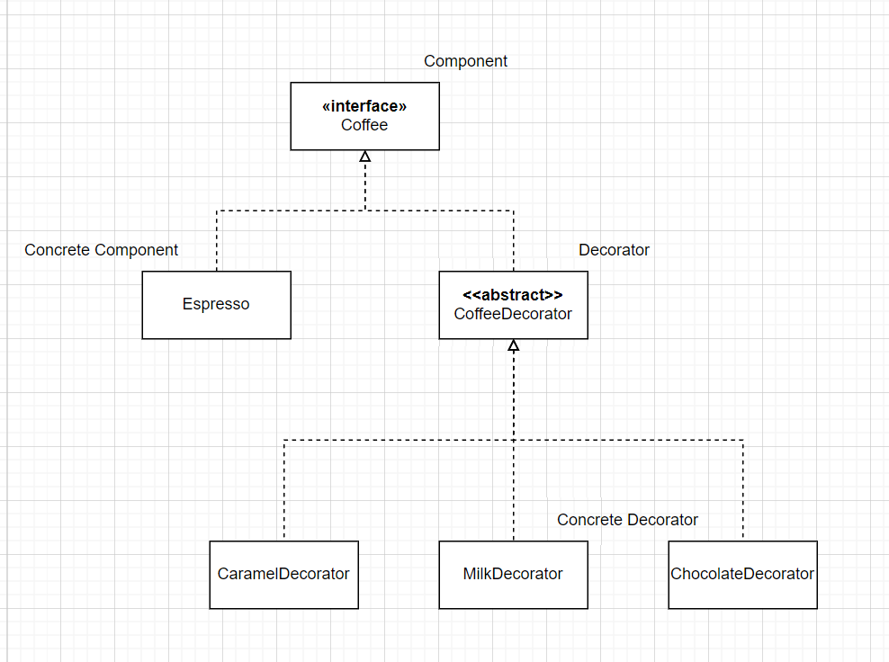
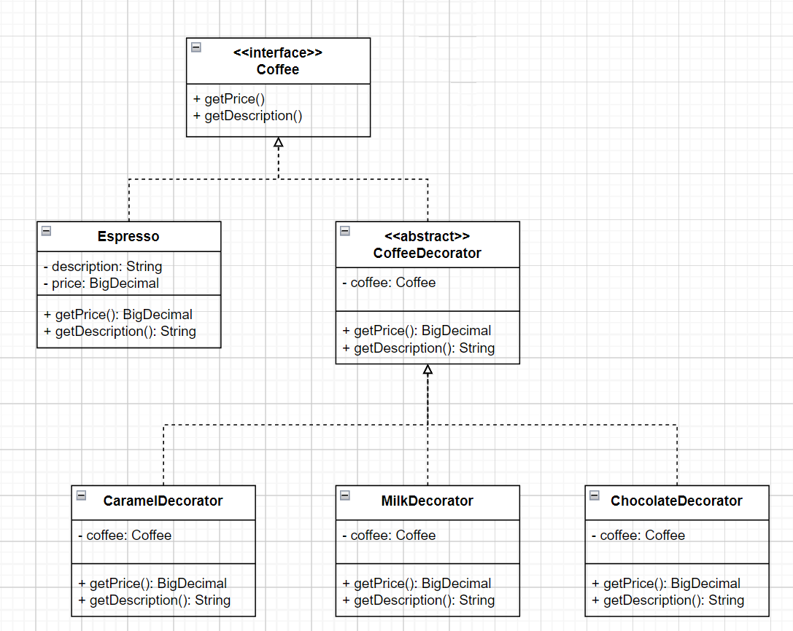

# Decorator Pattern

decorator is a **structural design pattern** that lets you **attach new behaviors to objects**
by placing these objects inside special **wrapper objects** that contain the behaviors.

extending a class is the first thing that comes to mind when you need to alter an object's behavior.

however inheritance has several serious caveats(주의사항) that you need to be aware of

- inheritance is static. you can't alter the behavior of an existing object at runtime.
  you can only replace the whole object with another one that's created from a different subclass.
- subclasses can have just one parent class. in most languages, inheritance doesn't let a class
  inherit behaviors of multiple classes at the same time.

one of the way to overcome these caveats is by using **Aggregation** or **Composition** instead of
inheritance.

both of the alternatives work almost the same way: **one object has a reference to another and
delegates it some work**, whereas(반면) with inheritance, the object itself is able to do that work,
inheriting the behavior from its superclass.

with this new approach you can easily substitute(바꾸다) the linked "helper" object with another,
changing the behavior of the container at runtime.

an object can use the behavior of various classes, having references to multiple objects and
delegating them all kinds of work.

**Aggregation / Composition is the key principal behind many design patterns**, including Decorator.

## when to use

- use the decorator pattern when you need to be able to assign extra behaviors to objects at runtime
  without breaking the code that uses these objects.

- use the pattern when it's awkward(어색한) or not possible to extend an object's behavior using
  inheritance.

## pros and cons

### pros

- you can extend an object's behavior without making a new subclass.
- you can **add or remove responsibilities from an object at runtime**.
- you can **combine several behaviors by wrapping an object into multiple decorators**.
- **SRP**
    - you can divide a monolithic class that implements many possible variants of behavior into
      several smaller classes.

### cons

- it's **hard to remove a specific wrapper from the wrappers stack**.
- it's hard to implement a decorator in such a way that its behavior does not depend on the order in
  the decorators stack.
- the initial configuration code of layers might look pretty ugly.

## implementation

Component : declares the **common interface for both wrappers and wrapped objects**.

Concrete Component : **class of objects being wrapped**. it defines the basic behavior, which can be
altered by decorators.

Base Decorator : **class has a field for referencing a wrapped object**. The field's type should be
declared as the component interface, so it can contain both concrete components and decorators.
The base decorator delegates all operations to the wrapped object.

Concrete Decorators : **define extra behaviors that can be added to components dynamically.**
Concrete Decorators override methods of the base decorator and execute their behavior either before
or after calling the parent method.

